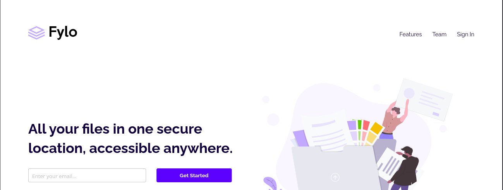
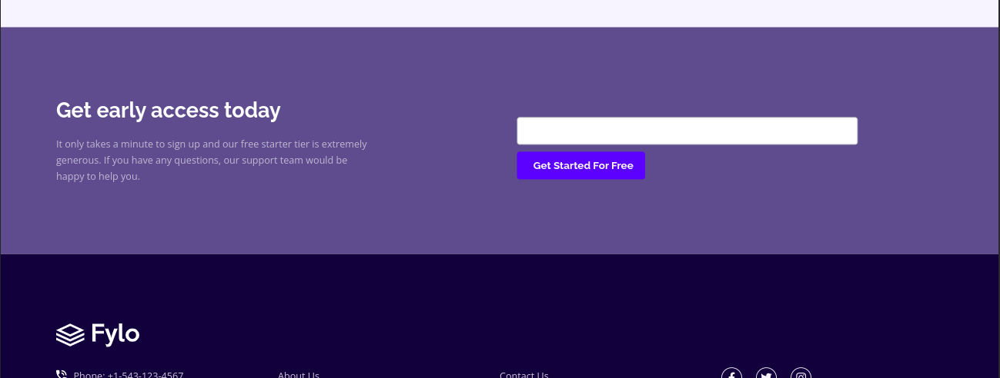
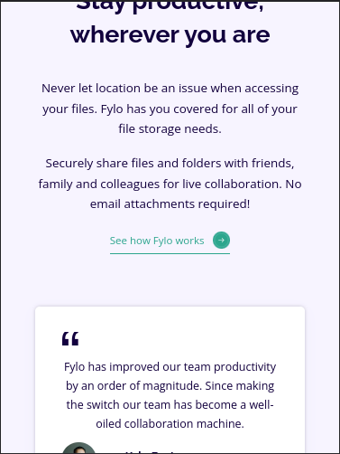
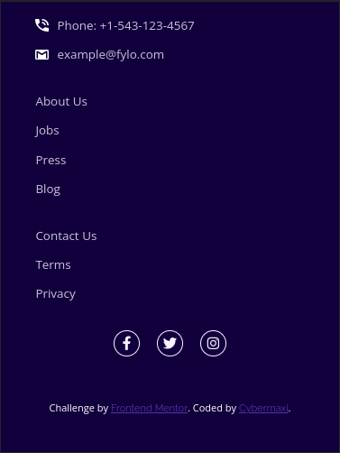

# Frontend Mentor - Fylo landing page with two column layout solution

This is a solution to the [Fylo landing page with two column layout challenge on Frontend Mentor](https://www.frontendmentor.io/challenges/fylo-landing-page-with-two-column-layout-5ca5ef041e82137ec91a50f5). Frontend Mentor challenges help you improve your coding skills by building realistic projects.

## Table of contents

- [The challenge](#the-challenge)
- [Screenshot](#screenshot)
- [Links](#links)
- [Built with](#built-with)
- [Author](#author)

### The challenge

Users should be able to:

- View the optimal layout for the site depending on their device's screen size
- See hover states for all interactive elements on the page

### Screenshot

### Links

- Solution URL: [Click here](https://github.com/Cybermaxi7/Fylo-Landing-Page-With-Two-Column-Layout/)
- Live Site URL: [Click here](https://cybermaxi7.github.io/Fylo-Landing-Page-With-Two-Column-Layout/)

### Built with

- Semantic HTML5 markup
- CSS custom properties
- Flexbox

## Author

- Frontend Mentor - [@Cybermaxi7](https://www.frontendmentor.io/profile/Cybermaxi7)
- Twitter - [@Cybermaxi7](https://www.twitter.com/Cybermaxi7)
